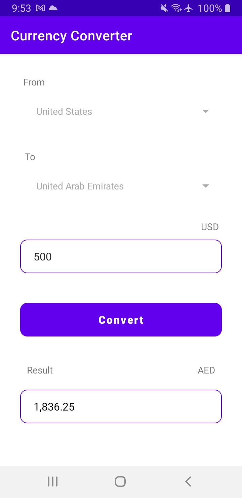

#Currency Converter

 

  

 

## Architecture
* Built with MVVM Clean Architecture

## Built With 🛠
- [Kotlin](https://kotlinlang.org/) - Official programming language for Android development.
- [DataBinding](https://developer.android.com/topic/libraries/data-binding) - Support library that allows to bind UI components.
- [DI with Hilt](https://developer.android.com/training/dependency-injection/hilt-android) - Hilt is a dependency injection library for Android that reduces the boilerplate of doing manual dependency injection in your project
- [Coroutines](https://developer.android.com/kotlin/coroutines) - A coroutine is a concurrency design pattern that you can use on Android to simplify code that executes asynchronously.
- [LiveData](https://developer.android.com/topic/libraries/architecture/livedata) - LiveData is an observable data holder class. Unlike a regular observable, LiveData is lifecycle-aware.
- [Retrofit](https://square.github.io/retrofit/) - A type-safe HTTP client for Android and Java.
- [GET GEO API](https://currency.getgeoapi.com/) - An API to get currency rate and conversion.

